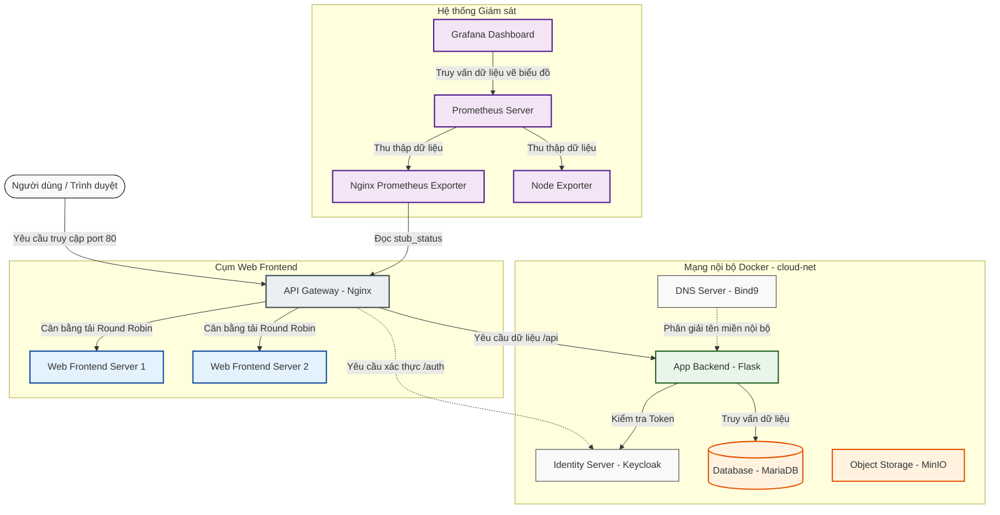

# ☁️ DỰ ÁN HẠ TẦNG ĐIỆN TOÁN ĐÁM MÂY THU NHỎ (MINI-CLOUD INFRASTRUCTURE)

> **Môn học**: Điện toán đám mây (Cloud Computing)  
> **Nhóm thực hiện**:
> - 👩‍💻 **Đinh Thị Thủy Tiên** - Repo gốc: https://github.com/tiendinhne/cloudcomputing
> - 👩‍💻 **Phạm Thủy Tiên**
> - 👩‍💻 **Nguyễn Thị Minh Hương**

---

## 📌 Giới Thiệu Chung

Dự án này là một mô hình giả lập **Hạ tầng Điện toán Đám mây thu nhỏ (Mini-Cloud Infrastructure)** được xây dựng và triển khai bằng công nghệ đóng gói container **Docker** và quản lý bởi **Docker Compose**. 

Hệ thống tích hợp đầy đủ các dịch vụ cốt lõi của một nền tảng Cloud hiện đại bao gồm:
*   **Cân bằng tải (Load Balancing) & Cổng kết nối (API Gateway)**
*   **Hệ thống phân giải tên miền nội bộ (Internal DNS)**
*   **Dịch vụ xác thực và quản lý người dùng (Identity Provider - OIDC/OAuth2)**
*   **Cơ sở dữ liệu quan hệ (Relational Database)**
*   **Lưu trữ tệp tin lớn (Object Storage)**
*   **Hệ thống giám sát trạng thái & Hiệu năng (Monitoring & Dashboard)**

---

## 🍽️ Giải Thích Hệ Thống Bằng Hình Ảnh "Nhà Hàng Thông Minh"
*(Dành cho tất cả mọi người, kể cả những bạn không có nền tảng công nghệ)*

Để dễ hình dung hệ thống này hoạt động như thế nào, hãy tưởng tượng chúng ta đang vận hành một **Nhà Hàng Buffet Lớn**:

| Thành phần trong Dự án | Bộ phận tương đương trong Nhà Hàng | Vai trò & Nhiệm vụ thực tế |
| :--- | :--- | :--- |
| **API Gateway & Load Balancer** *(Nginx)* | 🤵 **Người Lễ Tân & Điều Phối** | Đứng ở cửa ra vào. Khi có khách đến, lễ tân sẽ chỉ dẫn khách vào các bàn ăn trống luân phiên nhau (chia đều tải để không bàn nào bị quá tải) và hướng dẫn khách đi đúng khu vực (ăn buffet, quầy thanh toán, bảo vệ...). |
| **Web Frontend** *(2 Server chạy song song)* | 🍽️ **Các Quầy Phục Vụ Ăn Uống** | Nơi khách hàng trực tiếp nhìn thấy món ăn, chọn món và trải nghiệm dịch vụ. Nhà hàng có 2 quầy giống hệt nhau chạy song song, nếu 1 quầy bận hoặc tạm đóng cửa để dọn dẹp, quầy kia vẫn phục vụ bình thường (Đảm bảo hệ thống luôn hoạt động - High Availability). |
| **Application Backend** *(Flask App)* | 🍳 **Nhà Bếp** | Nằm ở phía sau, trực tiếp nhận order món ăn từ Quầy Phục Vụ, chế biến nguyên liệu và gửi món ăn đã hoàn thiện ra ngoài. Người ăn (User) không cần vào bếp mà chỉ giao tiếp qua nhân viên quầy. |
| **Relational Database** *(MariaDB)* | 🗄️ **Tủ Đông Đựng Nguyên Liệu Cố Định** | Nơi cất giữ các nguyên liệu được sắp xếp ngăn nắp, phân loại rõ ràng (ví dụ: khay thịt, khay rau) tương đương với dữ liệu có cấu trúc như Danh sách sinh viên, thông tin tài khoản. |
| **Object Storage** *(MinIO)* | 📦 **Kho Chứa Đồ Khổng Lồ** | Nơi lưu trữ các thùng hàng lớn, đồ dùng cồng kềnh, hình ảnh, tài liệu giới thiệu nhà hàng. |
| **Identity Server** *(Keycloak)* | 🛡️ **Bảo Vệ Kiểm Soát Vé Vào Cửa** | Khách hàng muốn vào khu vực VIP cần xuất trình vé (Token). Anh bảo vệ sẽ kiểm tra xem vé có hợp lệ, còn hạn không để cho phép khách đi qua cửa. |
| **Internal DNS** *(Bind9)* | 🪧 **Bảng Chỉ Dẫn Đường Đi Nội Bộ** | Giúp các nhân viên trong nhà hàng biết "Phòng bếp ở đâu", "Kho ở hướng nào" bằng tên gọi thân thiện thay vì phải nhớ toạ độ bản vẽ kỹ thuật phức tạp. |
| **Monitoring System** *(Prometheus & Grafana)* | 📊 **Người Quản Lý Nhà Hàng** | Cầm máy đo nhiệt độ tủ lạnh, đếm số lượng khách ra vào, đo tốc độ phục vụ của bếp. Tất cả số liệu được vẽ thành biểu đồ trực quan trên máy tính để chủ nhà hàng biết lúc nào quá tải để xử lý kịp thời. |

---

## 🛠️ Kiến Trúc Kỹ Thuật (Dành cho Tech Readers)

### 📊 Sơ đồ luồng hoạt động (Architecture Flow)

Dưới đây là cách các dịch vụ tương tác với nhau khi người dùng gửi yêu cầu tới hệ thống:



---

## 📂 Cấu Trúc Mã Nguồn Dự Án

Thư mục dự án được tổ chức mô-đun hóa, mỗi thư mục tương ứng với một container dịch vụ:

*   📂 `api-gateway-proxy-server/`: Chứa file cấu hình `nginx.conf` để định tuyến và cân bằng tải.
*   📂 `web-frontend-server/`: Chứa mã nguồn giao diện HTML tĩnh được chia tải.
*   📂 `application-backend-server/`: Ứng dụng Flask (Python) xử lý các API lấy dữ liệu sinh viên và giao tiếp xác thực JWT.
*   📂 `authentication-identity-server/`: Chứa dữ liệu cấu hình Keycloak.
*   📂 `relational-database-server/`: Chứa các script SQL khởi tạo cơ sở dữ liệu học sinh (`002_studentdb.sql`) trên MariaDB.
*   📂 `object-storage-server/`: Lưu trữ dữ liệu MinIO (Object Storage).
*   📂 `internal-dns-server/`: Cấu hình BIND9 phục vụ phân giải DNS cục bộ.
*   📂 `monitoring-prometheus-server/` & `monitoring-grafana-dashboard-server/`: Cấu hình hệ thống Prometheus thu thập chỉ số hiệu năng và Grafana trực quan hóa số liệu.
*   📄 `docker-compose.yml`: File cấu hình tổng thể để khởi chạy toàn bộ 10 container dịch vụ cùng lúc.

---

## 🚀 Hướng Dẫn Khởi Chạy Dự Án

### Đòi hỏi hệ thống
*   Đã cài đặt **Docker** và **Docker Compose** trên máy tính của bạn.

### Các bước thực hiện

1.  **Tải mã nguồn về máy** (nếu chưa có):
    ```bash
    git clone <url-repository>
    cd cloudcomputing
    ```

2.  **Khởi chạy toàn bộ hệ thống**:
    Chạy lệnh duy nhất sau để Docker tự động tải ảnh, build các service và chạy ngầm dưới nền:
    ```bash
    docker compose up -d
    ```

3.  **Kiểm tra trạng thái các container**:
    ```bash
    docker compose ps
    ```
    Hãy đảm bảo tất cả các dịch vụ đều ở trạng thái `running` (hoặc `up`).

---

## 🌐 Các Đường Dẫn Truy Cập Trải Nghiệm (Ports Map)

Sau khi khởi chạy thành công, bạn có thể mở trình duyệt và truy cập vào các địa chỉ sau:

| Dịch vụ | Địa chỉ truy cập | Tài khoản thử nghiệm (nếu có) | Tính năng |
| :--- | :--- | :--- | :--- |
| **Cổng vào hệ thống (Nginx)** | [http://localhost](http://localhost) | Không yêu cầu | Xem trang web chính và chuyển tiếp tới các API. |
| **Web Frontend trực tiếp** | [http://localhost:8080](http://localhost:8080) | Không yêu cầu | Truy cập trực tiếp Web Frontend (bypass qua Gateway). |
| **API Danh sách Sinh viên (Database)** | [http://localhost/api/students-db](http://localhost/api/students-db) | Không yêu cầu | Xem bảng sinh viên được lấy trực tiếp từ MariaDB. |
| **API Lấy file JSON** | [http://localhost/api/student](http://localhost/api/student) | Không yêu cầu | Đọc dữ liệu sinh viên từ file JSON trên Backend. |
| **Xác thực Keycloak Admin** | [http://localhost:8081](http://localhost:8081) | `admin` / `admin` | Quản lý người dùng, phân quyền đăng nhập OIDC. |
| **Kho lưu trữ MinIO Console** | [http://localhost:9001](http://localhost:9001) | `minioadmin` / `minioadmin` | Giao diện quản lý các File (Object Storage). |
| **Hệ thống giám sát Grafana** | [http://localhost:3000](http://localhost:3000) | `admin` / `admin` | Xem các biểu đồ đo đạc hiệu suất phần cứng và tải Nginx. |
| **Prometheus Metrics** | [http://localhost:9090](http://localhost:9090) | Không yêu cầu | Xem các chỉ số thô được hệ thống thu thập về. |

### Lệnh dừng hệ thống khi không sử dụng nữa:
```bash
docker compose down
```

---
*Đây là dự án môn học tại trường, những bạn muốn tham khảo có thể xem và nghiên cứu thêm.*
